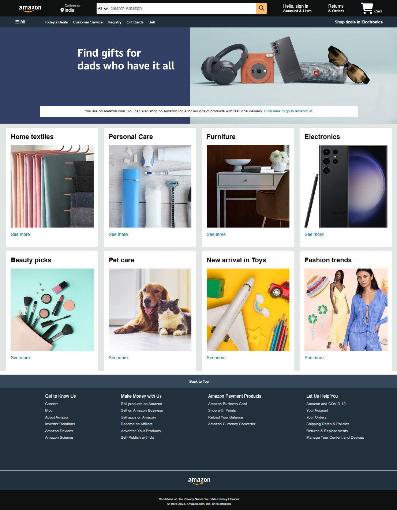

# 🛒 Amazon Homepage Clone

A front-end clone of the Amazon homepage built using **HTML** and **CSS**.  
This project focuses on recreating a real-world e-commerce layout while improving **UI structuring**, **responsive design**, and **styling consistency**.

---

## 🚀 Project Overview

The goal of this project was to understand how large e-commerce platforms structure their interfaces and maintain visual consistency across multiple sections.

The clone recreates key components such as:
- **Navigation bar with search layout**
- **Promotional banners**
- **Product category sections**
- **Structured footer**

Special attention was given to **spacing, alignment, typography, and layout hierarchy**.

---

## 🧩 Features

- ✅ Structured navigation bar  
- ✅ Search section UI  
- ✅ Product category grid  
- ✅ Promotional banner layout  
- ✅ Clean footer design  
- ✅ Hover effects and styled buttons  

---

## 🛠️ Tech Stack

- **HTML5**
- **CSS3**

---

## 📚 What I Learned

- Structuring complex pages using **semantic HTML**
- Creating **responsive and visually consistent layouts**
- Improving **CSS positioning and styling**
- Maintaining UI consistency across multiple sections

---

## 📸 Screenshots

---

## 📌 Future Improvements

- Add **JavaScript interactivity**
- Improve **mobile responsiveness**
- Build additional pages (cart, product page)

---

⭐ If you found this project helpful, feel free to star the repository!
